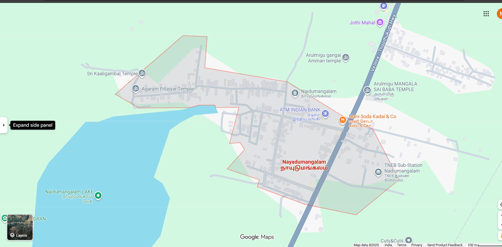

# Ex04 Places Around Me
## Date: 10/05/2025

## AIM
To develop a website to display details about the places around my house.

## DESIGN STEPS

### STEP 1
Create a Django admin interface.

### STEP 2
Download your city map from Google.

### STEP 3
Using ```<map>``` tag name the map.

### STEP 4
Create clickable regions in the image using ```<area>``` tag.

### STEP 5
Write HTML programs for all the regions identified.

### STEP 6
Execute the programs and publish them.

## CODE
```
map.html

<!-- Image Map Generated by http://www.image-map.net/ -->
<html>
<body>


<map name="image-map">
    <area target="_blank" alt="TNEB" title="TNEB" href="TNEB.html" coords="1629,717,1333,584" shape="rect">
    <area target="_blank" alt="ATM" title="ATM" href="ATM.html" coords="1022,311,1272,459" shape="rect">
    <area target="_blank" alt="LAKE" title="LAKE" href="LAKE.html" coords="160,672,395,776" shape="rect">
    <area target="_blank" alt="TEMPLE" title="TEMPLE" href="TEMPLE.html" coords="326,229,653,373" shape="rect">
</img>
</map>
</body>
</html>

ATM.html

<html>
<head>
<title>My City</title>
</head>
<body bgcolor="Gray">
<h1 align="center">
<font color="white"><b></b></font> 
</h1>
<h3 align="center">
<font color="blue"><b>Paruvathamalai - Memories</b></font>
</h3>
<hr size="3" color="lightblue"
<p align="justify">
<font face="Georgia" size="5">
Paruvathamalai holds a sacred place in my heart — a memory etched in time. During my 9th standard, I visited this divine mountain just once, yet it left a lasting mark. Climbing to the top to see Lord Shiva was both a spiritual and emotional journey. That day was unforgettable, not just for the view, but for the company I cherished. My sister, my cousins, and I — together we shared laughter, devotion, and adventure. It wasn't just a visit; it was a moment of bonding, faith, and pure joy.
</font>
</p>
</body>
</html>

LAKE.html

<html>
<head>
<title>My City</title>
</head>
<body bgcolor="Gray">
<h1 align="center">
<font color="white"><b></b></font> 
</h1>
<h3 align="center">
<font color="blue"><b>Paruvathamalai - Memories</b></font>
</h3>
<hr size="3" color="lightblue"
<p align="justify">
<font face="Georgia" size="5">
Paruvathamalai holds a sacred place in my heart — a memory etched in time. During my 9th standard, I visited this divine mountain just once, yet it left a lasting mark. Climbing to the top to see Lord Shiva was both a spiritual and emotional journey. That day was unforgettable, not just for the view, but for the company I cherished. My sister, my cousins, and I — together we shared laughter, devotion, and adventure. It wasn't just a visit; it was a moment of bonding, faith, and pure joy.
</font>
</p>
</body>
</html>

TNEB.html

<html>
<head>
<title>My City</title>
</head>
<body bgcolor="Gray">
<h1 align="center">
<font color="white"><b></b></font> 
</h1>
<h3 align="center">
<font color="blue"><b>Paruvathamalai - Memories</b></font>
</h3>
<hr size="3" color="lightblue"
<p align="justify">
<font face="Georgia" size="5">
Paruvathamalai holds a sacred place in my heart — a memory etched in time. During my 9th standard, I visited this divine mountain just once, yet it left a lasting mark. Climbing to the top to see Lord Shiva was both a spiritual and emotional journey. That day was unforgettable, not just for the view, but for the company I cherished. My sister, my cousins, and I — together we shared laughter, devotion, and adventure. It wasn't just a visit; it was a moment of bonding, faith, and pure joy.
</font>
</p>
</body>
</html>

TEMPLE.html

<html>
<head>
<title>My City</title>
</head>
<body bgcolor="Gray">
<h1 align="center">
<font color="white"><b></b></font> 
</h1>
<h3 align="center">
<font color="blue"><b>Paruvathamalai - Memories</b></font>
</h3>
<hr size="3" color="lightblue"
<p align="justify">
<font face="Georgia" size="5">
Paruvathamalai holds a sacred place in my heart — a memory etched in time. During my 9th standard, I visited this divine mountain just once, yet it left a lasting mark. Climbing to the top to see Lord Shiva was both a spiritual and emotional journey. That day was unforgettable, not just for the view, but for the company I cherished. My sister, my cousins, and I — together we shared laughter, devotion, and adventure. It wasn't just a visit; it was a moment of bonding, faith, and pure joy.
</font>
</p>
</body>
</html>

```

## OUTPUT


## RESULT
The program for implementing image maps using HTML is executed successfully.
